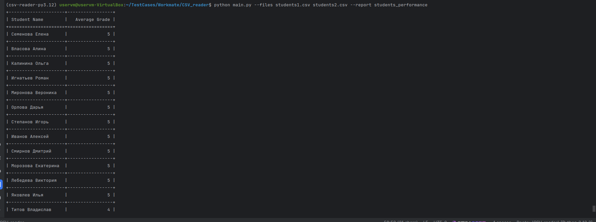
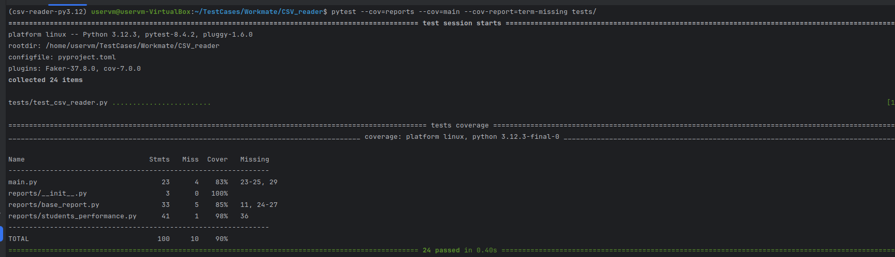

# CSV Reader Test Case

Проект CSV_reader_test_case представляет собой инструмент для чтения CSV-файлов и формирования различных отчетов на их основе. Основные цели проекта — быстрое и удобное извлечение данных из CSV с возможностью генерации настраиваемых отчетов.

## Основные возможности

- Чтение CSV-файлов с именами студентов и оценками
- Генерация отчетов по успеваемости студентов
- Расширяемость: легко добавить новый тип отчета через паттерн фабрики
- Поддержка командной строки с аргументами для выбора файлов и типа отчета

## Пример использования

Для запуска программы используйте команду:
```bash
python main.py --files file1.csv file2.csv --report student_performance
```
где `--files` — список CSV-файлов, а `--report` — тип генерируемого отчета.

### Пример вывода:


## Тесты и покрытие

Проект покрыт юнит-тестами, обеспечивающими проверку ключевых функций чтения и генерации отчетов. Для запуска тестов и оценки покрытия используйте:
```bash
pytest --cov=.
```

Покрытие кода тестами составляет около 90%, что обеспечивает надежность и стабильность работы.


## Как добавить новый отчет

1. Создайте новый класс отчета, расширяющий базовый класс `BaseReport`.
2. Реализуйте методы чтения, валидации и генерации данных.
3. Зарегистрируйте новый класс в `ReportFactory` через функцию `register`.
4. Теперь новый отчет можно вызывать через параметр `--report` в командной строке.

### Пример
```python
# your_report.py
class NewReport(BaseReport):
def generate(self):
# логика генерации отчета
pass

# reports/__init__.py
ReportFactory.register("new_report", NewReport)
```